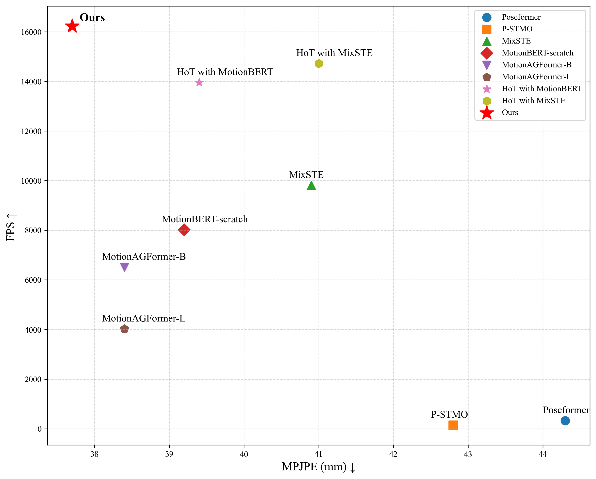

# Spectral Compression Transformer with Line Pose Graph

<a href="https://pytorch.org/get-started/locally/"></a>

## Abstract

Transformer-based 3D human pose estimation methods suffer from high computational costs due to the quadratic complexity of self-attention with respect to sequence length. Additionally, pose sequences often contain significant redundancy between frames. In this work, we introduce the Spectral Compression Transformer (SCT) to reduce sequence length and accelerate computation. The SCT encoder treats hidden features between blocks as Temporal Feature Signals (TFS) and applies the Discrete Cosine Transform, a Fourier transform-based technique, to determine the spectral components to be retained. By filtering out certain high-frequency noise components, SCT compresses the sequence length and reduces redundancy. To further enrich the input sequence with prior structural information, we propose the Line Pose Graph (LPG) based on line graph theory. The LPG generates skeletal position information that complements the input 2D joint positions, thereby improving the model's performance. Finally, we design a dual-stream network architecture to effectively model spatial joint relationships and the compressed motion trajectory within the pose sequence. Extensive experiments on two benchmark datasets demonstrate that our model achieves state-of-the-art performance with improved computational efficiency.

## Highlights
🚀 Improve inference speed using SCT

✅ Enhance the model's expressive ability

💡 Embed into other models and manually fine-tune sigma to improve efficiency and accuracy.
<p align="center">
  
  <br>
  <em>FPS vs. MPJPE in mainstream 3DHPE backbone</em>
</p>


## Environment
For installation of the project dependencies, please run:
```bash
conda create -n sct python=3.7 anaconda
conda activate sct
# Please install PyTorch according to your CUDA version.
conda install pytorch torchvision torchaudio pytorch-cuda=11.6 -c pytorch -c nvidia
pip install -r requirements.txt
```

## Data
### Human3.6M
1. Download the finetuned Stacked Hourglass detections and our preprocessed H3.6M data [here](https://1drv.ms/u/s!AvAdh0LSjEOlgU7BuUZcyafu8kzc?e=vobkjZ) and unzip it to `data/motion3d`.

2. Slice the motion clips (len=243, stride=81)

   ```bash
   python tools/convert_h36m.py
   ```

## Model Pretraining
### Human3.6M
The pretrain weights of our model can be downloaded from [here](https://drive.google.com/file/d/179H4UzosuSNnvn6WQ3_Mh1gKcf0SK14T/view?usp=sharing). Place it in the 'checkpoint' folder.


## Evaluation
### Human3.6M
```bash
python train.py --config configs/MB_train_h36m.yaml --evaluate checkpoint/best_epoch.bin        
```

## Demo
First, you need to enter the demo/lib/checkpoint folder, refer to the README file there to download the YOLOv3 and HRNet weights, and place them in the './demo/lib/checkpoint' folder.

Then, execute the following command in the root directory of the file:
```
python demo/vis.py --video sample_video.mp4
```
Sample demo output:

<p align="center">

</p>

## Acknowledgement
Our code refers to the following repositories:
- [MotionBERT](https://github.com/Walter0807/MotionBERT)

We thank the authors for releasing their codes.
